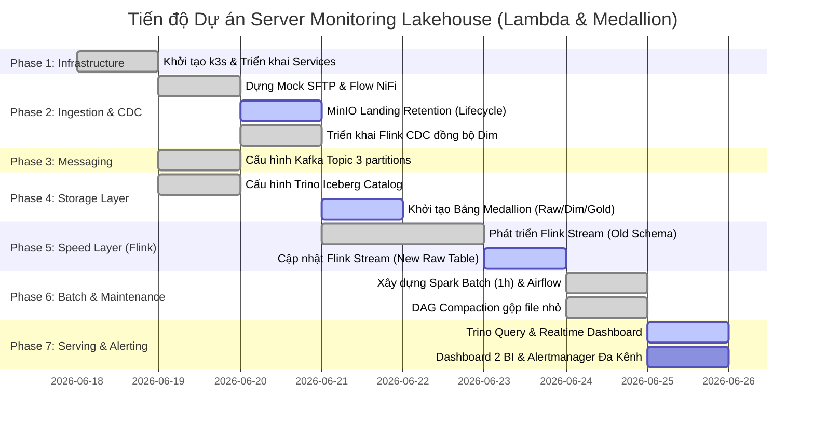

# Kế hoạch triển khai Chi tiết & Tiến độ Dự án (Project Roadmap & Steps)

Tài liệu này tổng hợp toàn bộ các bước cần thực hiện để hoàn thành dự án **Hệ thống Giám sát Server Lakehouse** dựa trên [DETAILED_REQUIREMENTS.md](file:///home/haiden/bku/vdt/server-monitoring-lakehouse/DETAILED_REQUIREMENTS.md).

---

## 🗺️ Tổng quan Tiến độ

---

## 🛠️ Chi tiết các Bước thực hiện

### 🟩 Bước 1: Thiết lập Hạ tầng (Infrastructure) - **[HOÀN THÀNH]**
- [x] Khởi tạo Cluster k3s/k3d sử dụng script [bootstrap.sh](file:///home/haiden/bku/vdt/server-monitoring-lakehouse/infrastructure/scripts/bootstrap.sh)
- [x] Triển khai toàn bộ Services qua Helm và Manifests sử dụng [deploy-all.sh](file:///home/haiden/bku/vdt/server-monitoring-lakehouse/infrastructure/scripts/deploy-all.sh)
- [x] Kiểm tra và xác nhận trạng thái các Pods chạy thành công (NiFi, Kafka, Flink, Minio, Hive-Metastore, Trino, Prometheus, Grafana).

---

### 🟩 Bước 2: Cấu hình Luồng Thu thập & Đồng bộ (Ingestion & CDC Layer) - **[HOÀN THÀNH]**
- [x] **Dựng Mock SFTP Server:**
  - Viết Manifest deploy một container SFTP đơn giản trong namespace `ingestion`.
  - Cấu hình tài khoản sftp, mount volume và tạo thư mục chứa metrics file (CSV/XML).
- [x] **Khởi tạo Buckets trên MinIO & Lifecycle Retention:**
  - [x] Tạo bucket `lakehouse` làm nơi lưu trữ dữ liệu thô (folder `raw-file`).
  - [x] Thiết lập quy tắc **Object Lifecycle Expiration = 24h** trên folder `raw-file` để tự động xóa sạch file cũ, tối ưu I/O.
- [x] **Xây dựng Dataflow trên NiFi:**
  - Polling file từ SFTP mỗi 1 phút bằng **ListSFTP/FetchSFTP**.
  - Đẩy file nguyên bản lên MinIO `lakehouse/raw-file/yyyy/mm/dd/HH/`.
  - Gửi event notification sang Kafka topic `file-arrival-events`.
- [x] **Đồng bộ Metadata bằng Flink CDC:**
  - [x] Triển khai Flink CDC giám sát DB cấu hình (`App_DB`).
  - [x] Tự động capture CDC events và đồng bộ gần realtime sang bảng danh mục (`Iceberg Cấu Hình - Dim`).

---

### 🟩 Bước 3: Hàng đợi thông điệp (Messaging Layer - Kafka) - **[100% HOÀN THÀNH]**
- [x] **Cấu hình Kafka Topic:**
  - Tạo topic `file-arrival-events` với 3 Partitions để nâng cao tính song song.
  - Cấu hình retention time của topic là 7 ngày (`cleanup.policy=delete`, `retention.ms=604800000`).
- [x] **Kiểm tra trạng thái:**
  - Giám sát qua Kafka UI ([http://localhost:9080](http://localhost:9080)) để kiểm chứng luồng message từ NiFi hoạt động ổn định.

---

### 🟩 Bước 4: Lưu trữ & Phân tầng Medallion (Storage & Metadata Layer - Iceberg + Minio + Hive) - **[100% HOÀN THÀNH]**
- [x] **Cấu hình Trino Iceberg Catalog:**
  - Đồng bộ Trino, Hive Metastore và MinIO storage thông qua Helm values.
- [x] **Khởi tạo các bảng Medallion:**
  - [x] Đã tạo bảng cũ `server_metrics` để thử nghiệm luồng dữ liệu.
  - [x] `Bảng Log Thô (Fact - Ice_Raw)`: Thiết kế lại theo schema mới (chỉ chứa `server_id` và các chỉ số đo đạc phần cứng) phân vùng theo ngày.
  - [x] `Bảng Cấu Hình (Dim - Ice_Dim)`: Khởi tạo bảng danh mục cấu hình Tỉnh/Trạm.
  - [x] `Bảng KPI Tổng Hợp (Gold - Ice_Final)`: Khởi tạo bảng lưu trữ dữ liệu KPI đã được tính toán làm giàu.

---

### 🟩 Bước 5: Phát triển & Triển khai luồng Speed Layer (Processing - Flink) - **[100% HOÀN THÀNH]**
- [x] **Xây dựng Flink Streaming Parser:**
  - Đọc event từ topic `file-arrival-events`, tải file tương ứng từ MinIO `landing-zone`.
  - Parse XML/CSV tùy định dạng và map kiểu dữ liệu, cast Timestamp về SQL Timestamp.
  - [x] Đã hoàn thành code gốc đẩy dữ liệu thô sang bảng cũ `server_metrics` (Job ID: `6f52c4011025f9f0d9096500ba979165`).
  - [x] **Cập nhật luồng Realtime (Mới)**: Sửa code Flink parser để loại bỏ các thông tin tĩnh, chỉ map `server_id` và các metrics phần cứng, sau đó sink xuống bảng mới `Iceberg Log Thô (Fact - Ice_Raw)` thay vì bảng cũ.
- [x] **Đóng gói & Submit Job mới**:
  - Đóng gói JAR Maven và deploy lại Flink Job mới lên cluster (Đã hoàn tất tự động hóa qua `setup-pipeline.sh`).

---

### 🟩 Bước 6: Phát triển luồng Batch Layer & Compaction (Airflow & Spark) - **[HOÀN THÀNH INFRA]**
- [x] **Xây dựng Spark Batch Job (1 giờ/lần):**
  - Đọc delta dữ liệu từ `Bảng Log Thô (Fact)`, thực hiện `JOIN` với `Bảng Cấu Hình (Dim)` để tính toán KPI trung bình vùng miền.
  - Làm giàu và ghi kết quả tổng hợp vào `Bảng KPI Tổng Hợp (Gold)`.
- [x] **Thiết lập Maintenance Compaction Job (00:00 hàng ngày):**
  - Chạy định kỳ vào nửa đêm để gộp các file Parquet nhỏ phân mảnh của bảng Log Thô thành các file lớn nhằm tối ưu hóa I/O bằng cách gọi: `CALL catalog.system.rewrite_data_files(...)`.
  - Lập lịch và tự động kích hoạt cả hai job Spark trên thông qua **Apache Airflow**.
- [x] **Triển khai hạ tầng batch distributed:**
  - Spark Standalone trong namespace `orchestration` gồm `1 Master + 3 Workers`.
  - Apache Airflow 3 quản lý 2 DAG: batch KPI mỗi giờ và compaction hằng ngày.
  - Metabase BI kết nối Trino để truy vấn bảng Gold `kpi_summary`.

---

### 🟨 Bước 7: Phân tách Serving & Giám sát Cảnh báo Đa kênh (Serving & Alerting Layer) - **[90% HOÀN THÀNH]**
- [ ] **Phân tách 2 Dashboards (Trino Serving):**
  - [x] Thiết lập Grafana Realtime Dashboard kết nối Trino truy vấn từ bảng cũ.
  - [x] Cập nhật Dashboard 1 để truy vấn từ bảng `Iceberg Log Thô` theo `server_id` mới (Đã hoàn tất cấu hình qua Helm upgrade values).
  - [ ] Thiết lập Dashboard 2 (BI Report) kết nối Trino truy vấn từ bảng `Iceberg KPI Tổng Hợp` báo cáo hiệu năng dài hạn theo Tỉnh/Trạm cho quản lý.
- [x] **Thiết lập Giám sát Hệ thống & Cấu hình Cảnh báo (Prometheus Alertmanager):**
  - [x] Prometheus tự động scraping metrics của Flink và Kafka.
  - [x] Cấu hình Prometheus Alertmanager và định tuyến cảnh báo (Critical/Warning) đến: **Slack/Discord Webhooks**, **Telegram Bot**, **Email (SMTP)** và **Custom Webhooks** hỗ trợ tự phục hồi.
  - [x] Hỗ trợ truy cập Web UI của Prometheus và Alertmanager từ máy host (thông qua port-forwarding hoặc Docker Bridge network).

---

## 📈 Trạng thái Dự án hiện tại

- **Hạ tầng (Infra):** **100% HOÀN THÀNH**
- **Luồng dữ liệu (Data Pipeline):** **95% HOÀN THÀNH** (NiFi $\rightarrow$ MinIO/Kafka $\rightarrow$ Flink & Flink CDC $\rightarrow$ Iceberg Fact & Dim tables hoàn tất chạy thực tế; Spark Batch, Airflow 3 và Metabase đã có infra/DAG, cần deploy để kiểm thử end-to-end trên cluster)
- **Giám sát & Cảnh báo đa kênh:** **90% HOÀN THÀNH** (Grafana Realtime Dashboard 1 đã hoàn tất chuyển sang dùng server_id thô, Alertmanager & các kênh cảnh báo đã cấu hình hoàn chỉnh, truy cập UI ngoài hoạt động ổn định)
