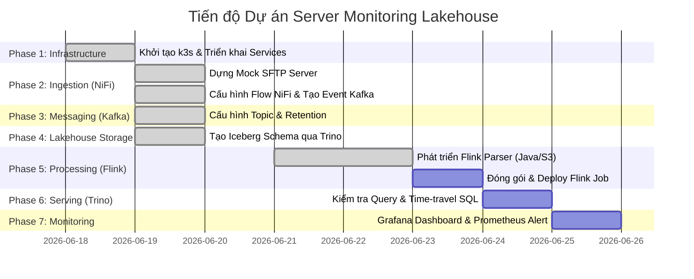

# Kế hoạch triển khai Chi tiết & Tiến độ Dự án (Project Roadmap & Steps)

Tài liệu này tổng hợp toàn bộ các bước cần thực hiện để hoàn thành dự án **Hệ thống Giám sát Server Lakehouse** dựa trên [DETAILED_REQUIREMENTS.md](file:///home/haiden/bku/vdt/server-monitoring-lakehouse/DETAILED_REQUIREMENTS.md).

---

## 🗺️ Tổng quan Tiến độ

---

## 🛠️ Chi tiết các Bước thực hiện

### 🟩 Bước 1: Thiết lập Hạ tầng (Infrastructure) - **[HOÀN THÀNH]**
- [x] Khởi tạo Cluster k3s/k3d sử dụng script [bootstrap.sh](file:///home/haiden/bku/vdt/server-monitoring-lakehouse/infrastructure/scripts/bootstrap.sh)
- [x] Triển khai toàn bộ Services qua Helm và Manifests sử dụng [deploy-all.sh](file:///home/haiden/bku/vdt/server-monitoring-lakehouse/infrastructure/scripts/deploy-all.sh)
- [x] Kiểm tra và xác nhận trạng thái các Pods chạy thành công (NiFi, Kafka, Flink, Minio, Hive-Metastore, Trino, Prometheus, Grafana).

---

### 🟩 Bước 2: Cấu hình Luồng Thu thập (Ingestion Layer - NiFi) - **[HOÀN THÀNH]**
- [x] **Dựng Mock SFTP Server:**
  - Viết Manifest deploy một container SFTP đơn giản trong namespace `ingestion`.
  - Cấu hình tài khoản sftp, mount volume và tạo thư mục chứa metrics file (CSV/XML).
- [x] **Khởi tạo Buckets trên Minio:**
  - Truy cập Minio Console ([http://localhost:9001](http://localhost:9001)) hoặc dùng client `mc`.
  - Tạo bucket `landing-zone` làm nơi lưu trữ dữ liệu thô.
- [x] **Xây dựng Dataflow trên NiFi:**
  - Truy cập NiFi UI ([https://localhost:8443/nifi](https://localhost:8443/nifi)).
  - Thiết lập Processor **ListSFTP** -> **FetchSFTP** để lấy file định kỳ mỗi 1 phút.
  - Thiết lập Processor **PutS3Object (Minio)** để ghi file vào path: `landing-zone/yyyy/mm/dd/HH/`.
  - Thiết lập Processor **PublishKafka** gửi message dạng JSON đến topic `file-arrival-events`.
    - *Schema Event:* `{"file_path": "s3a://landing-zone/...", "file_name": "...", "timestamp": "...", "format": "xml"}`
- [x] **Xử lý lỗi (Error Handling):**
  - Chuyển tiếp các file bị lỗi parse/upload sang folder `error/` trên SFTP hoặc Minio.
- [x] **Lưu trữ cấu hình:**
  - Export flow NiFi thành file JSON và lưu vào thư mục [nifi/flows/](file:///home/haiden/bku/vdt/server-monitoring-lakehouse/nifi/flows).

---

### 🟩 Bước 3: Hàng đợi thông điệp (Messaging Layer - Kafka) - **[HOÀN THÀNH]**
- [x] **Cấu hình Kafka Topic:**
  - Tạo topic `file-arrival-events` với tối thiểu 3 Partitions để tăng tính song song.
  - Cấu hình retention time của topic là 7 ngày (`cleanup.policy=delete`, `retention.ms=604800000`).
- [x] **Kiểm tra trạng thái:**
  - Truy cập Kafka UI ([http://localhost:9080](http://localhost:9080)) để kiểm chứng topic đã được khởi tạo thành công và theo dõi luồng message từ NiFi.

---

### 🟩 Bước 4: Lưu trữ & Metadata (Lakehouse Storage - Iceberg + Minio + Hive) - **[HOÀN THÀNH]**
- [x] **Cấu hình Trino Iceberg Catalog:**
  - Đảm bảo Trino đã liên kết chính xác với Hive Metastore và Minio thông qua [values.yaml](file:///home/haiden/bku/vdt/server-monitoring-lakehouse/infrastructure/helm/trino/values.yaml).
- [x] **Khởi tạo Iceberg Table:**
  - Chạy file SQL [monitoring.sql](file:///home/haiden/bku/vdt/server-monitoring-lakehouse/catalogs/iceberg/monitoring.sql) trên Trino để tạo Table: `iceberg.monitoring.server_metrics`.
  - Xác nhận bảng đã có định dạng lưu trữ cột `PARQUET` và phân vùng theo ngày `day(ts)`.

---

### 🟨 Bước 5: Viết và Triển khai Flink Job (Processing Layer)
- [x] **Thiết kế Flink Pipeline (Java) trong thư mục [flink/](file:///home/haiden/bku/vdt/server-monitoring-lakehouse/flink):**
  - **Source:** Đọc JSON message từ Kafka topic `file-arrival-events`.
  - **S3 Reader:** Sử dụng AWS SDK/Hadoop S3 FileSystem để đọc trực tiếp file từ link `file_path` trên Minio.
  - **Parser Engine:**
    - Parse XML (sử dụng Jackson XML) hoặc CSV (sử dụng OpenCSV) tùy thuộc vào trường `format` trong event.
  - **Data Mapping / Types Casting:**
    - Chuyển đổi định dạng: ép kiểu CPU/RAM/DISK/IO thành Float/Double, cast Timestamp về SQL Timestamp (`TIMESTAMP(6)`).
  - **Sink:** Đẩy dữ liệu vào Iceberg Table thông qua `Iceberg Flink Connector`.
  - *Lưu ý:* Đã sửa lỗi khởi tạo Catalog Loader (chuyển sang `CatalogLoader.hive()`) và cấu hình kết nối JobManager-TaskManager thành công.
- [ ] **Xây dựng & Đóng gói:**
  - Sử dụng Maven chạy lệnh `mvn clean package` trong thư mục [flink/](file:///home/haiden/bku/vdt/server-monitoring-lakehouse/flink) để tạo Shade JAR.
- [ ] **Deploy Flink Job:**
  - Submit package JAR lên Flink JobManager thông qua UI tại [http://localhost:8081](http://localhost:8081) hoặc CLI của Flink.

---

### 🟨 Bước 6: Truy vấn dữ liệu (Serving Layer - Trino Query)
- [ ] **Kiểm tra dữ liệu ghi nhận:**
  - Thực hiện các câu lệnh SQL truy vấn trực tiếp trên Trino UI hoặc CLI để kiểm tra dữ liệu do Flink ghi xuống.
- [ ] **Kiểm tra tính năng Time-travel:**
  - Chạy thử nghiệm truy vấn dữ liệu tại một snapshot hoặc mốc thời gian cụ thể trong quá khứ để đảm bảo cơ chế quản lý snapshot của Iceberg hoạt động tốt.

---

### 🟨 Bước 7: Giám sát & Dashboard (Monitoring Layer)
- [ ] **Cấu hình Prometheus Scraping:**
  - Đảm bảo Prometheus lấy được metrics của Flink (JobManager/TaskManager) và Kafka.
- [ ] **Thiết lập Grafana Dashboard:**
  - Tạo Data Source kết nối Grafana tới Trino (truy xuất trực tiếp Lakehouse) và Prometheus (truy xuất metrics real-time).
  - Xây dựng dashboard giám sát hiệu năng Server:
    - CPU, RAM, Disk, IO utilization theo thời gian.
    - So sánh hiệu năng giữa các Server.
  - Thiết lập cảnh báo (Alerting) khi các chỉ số RAM/CPU vượt quá ngưỡng 90%.

---

## 📈 Trạng thái Dự án hiện tại

- **Hạ tầng (Infra):** **100% HOÀN THÀNH**
- **Luồng dữ liệu (Data Pipeline):** **60% HOÀN THÀNH** (NiFi hoàn tất, Flink dev và fix xong, cụm Flink sẵn sàng)
- **Giám sát & Trực quan hóa:** **0% HOÀN THÀNH**
