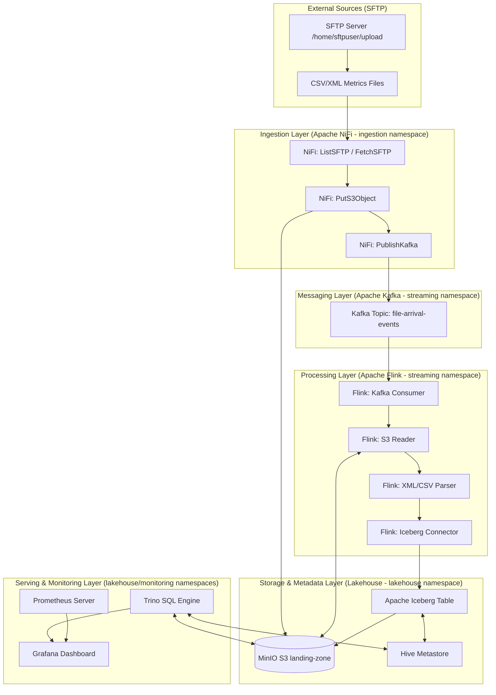

# Hệ thống Giám sát Server Lakehouse (Server Monitoring Lakehouse Platform)

Hệ thống giám sát máy chủ tập trung thời gian thực (100+ servers) sử dụng kiến trúc **Lakehouse** hiện đại để tối ưu hóa lưu trữ và truy vấn hiệu năng cao. Luồng dữ liệu đi qua các thành phần: **SFTP -> Apache NiFi -> MinIO (Landing Zone) & Apache Kafka -> Apache Flink -> Apache Iceberg -> Trino Query Engine -> Grafana Dashboard**.

Hạ tầng được triển khai hoàn toàn trên cluster **k3d/k3s (Kubernetes lightweight)** cấu hình đa-node giả lập môi trường Production thực tế.

---

## 🗺️ Sơ đồ Kiến trúc & Luồng dữ liệu (Data Flow)



---

## 🛠️ Yêu cầu chuẩn bị (Prerequisites)

Trước khi bắt đầu, hãy đảm bảo máy host của bạn đã cài đặt các công cụ sau:
- **Docker** (phiên bản >= 20.10)
- **k3d** (để quản lý cluster K3s cục bộ)
- **kubectl** (để tương tác với cluster)
- **Helm v3** (để triển khai các package)
- **Python 3** (cùng thư viện `requests` và `pyyaml` để chạy mock script và generator)
- Bộ nhớ RAM khuyến nghị: **>= 16 GB** (hệ thống được tối ưu hóa cực kỳ nhẹ, không dùng Bitnami cồng kềnh để tiết kiệm tối đa tài nguyên).

---

## 🚀 Hướng dẫn khởi chạy nhanh Hạ tầng

Hệ thống cung cấp sẵn các script tự động hóa toàn bộ quá trình thiết lập cluster và deploy ứng dụng.

### Bước 1: Khởi tạo cluster k3d
Chạy script bootstrap để tạo cluster `vdt-lakehouse` đa-node (1 Master, 2 Workers) và tự động cấu hình MTU 1400 tránh đứt gãy kết nối mạng:
```bash
chmod +x infrastructure/scripts/bootstrap.sh
./infrastructure/scripts/bootstrap.sh
```

### Bước 2: Triển khai toàn bộ Services
Chạy script deploy để tạo các namespace (`ingestion`, `streaming`, `lakehouse`, `monitoring`) và triển khai toàn bộ ứng dụng qua Helm & Manifests:
```bash
chmod +x infrastructure/scripts/deploy-all.sh
./infrastructure/scripts/deploy-all.sh
```

---

## 🌐 Thông tin cổng truy cập các dịch vụ

Sau khi deploy hoàn tất, toàn bộ các service đều được cấu hình LoadBalancer trực tiếp qua `localhost` của máy host:

| Dịch vụ | Địa chỉ truy cập (URL) | Tài khoản / Mật khẩu | Namespace |
| :--- | :--- | :--- | :--- |
| **Grafana (Dashboards)** | [http://localhost:3000](http://localhost:3000) | `admin` / `admin` | `monitoring` |
| **Apache NiFi (Ingestion)** | [https://localhost:8443/nifi](https://localhost:8443/nifi) | `admin` / `password123456` | `ingestion` |
| **MinIO Console (Storage)** | [http://localhost:9001](http://localhost:9001) | `admin` / `password123` | `lakehouse` |
| **Kafka UI (Topic Management)** | [http://localhost:9080](http://localhost:9080) | Không có | `streaming` |
| **Trino Server (SQL queries)** | [http://localhost:8888](http://localhost:8888) | User: `admin` | `lakehouse` |
| **Flink UI (Job Monitoring)** | [http://localhost:8081](http://localhost:8081) | Không có | `streaming` |

> [!IMPORTANT]
> **Lưu ý đối với Apache NiFi:** NiFi bắt buộc phải truy cập bằng giao thức **HTTPS**. Do chứng chỉ là tự ký, trình duyệt sẽ đưa ra cảnh báo bảo mật. Hãy chọn **Advanced** -> **Proceed to localhost (unsafe)** để tiếp tục truy cập.

---

## 🕹️ Hướng dẫn Chạy Demo Chi tiết (End-to-End)

Dưới đây là các bước chạy thử nghiệm hệ thống để kiểm chứng luồng dữ liệu tự động đổ về Lakehouse.

### Bước 1: Tạo dữ liệu giám sát giả lập (Mock Data)
Hệ thống cung cấp một script Python để tạo các tệp chỉ số hiệu năng máy chủ cục bộ (định dạng CSV hoặc XML luân phiên ngẫu nhiên) và tự động tải chúng lên máy chủ SFTP trong cluster:

Chạy script tạo mock data:
```bash
python3 infrastructure/scripts/generate-mock-data.py
```
*Mỗi lần chạy script này sẽ sinh ra dữ liệu cho 5 máy chủ giám sát (`prod-web-01`, `prod-web-02`, v.v.) và đẩy qua SFTP.*

### Bước 2: Quan sát luồng Ingestion & Processing
1. **Apache NiFi:** Truy cập [https://localhost:8443/nifi](https://localhost:8443/nifi). Bạn sẽ thấy NiFi tự động phát hiện file trên SFTP, đẩy file thô vào MinIO bucket `landing-zone/` theo định dạng phân cấp thời gian (`yyyy/mm/dd/HH/`), và phát hành một sự kiện JSON thông báo lên topic `file-arrival-events` của Kafka.
2. **Apache Flink:** Truy cập Flink UI tại [http://localhost:8081](http://localhost:8081) để kiểm tra Job Stream xử lý dữ liệu. Flink sẽ tiêu thụ sự kiện từ Kafka, tải tệp tương ứng từ MinIO, phân tích định dạng (CSV hoặc XML), ép kiểu trường dữ liệu hiệu năng và ghi trực tiếp xuống Iceberg Table.

### Bước 3: Truy vấn SQL bằng Trino & Thử nghiệm Time-travel
Bạn có thể truy vấn bảng Iceberg trực tiếp bằng Trino.

1. **Kiểm tra số lượng bản ghi đã cam kết (committed):**
```bash
python3 -c "
import requests
sql = 'SELECT count(*) FROM iceberg.monitoring.server_metrics'
r = requests.post('http://localhost:8888/v1/statement', data=sql, headers={'X-Trino-User': 'admin'})
print('Tổng số bản ghi trong Iceberg Table:', r.json()['data'][0][0])
"
```
*(Lưu ý: Flink ghi dữ liệu theo checkpoint chu kỳ 1 phút, do đó dữ liệu mới sẽ xuất hiện sau tối đa 60 giây).*

2. **Thử nghiệm tính năng Time-travel (Đặc trưng của Iceberg):**
Liệt kê danh sách các Snapshots (các thời điểm lịch sử dữ liệu được commit):
```bash
python3 -c "
import requests
sql = 'SELECT snapshot_id, committed_at FROM iceberg.monitoring.server_metrics\$snapshots ORDER BY committed_at DESC'
r = requests.post('http://localhost:8888/v1/statement', data=sql, headers={'X-Trino-User': 'admin'})
for row in r.json().get('data', []):
    print(f'Snapshot ID: {row[0]} | Thời gian commit: {row[1]}')
"
```
Truy vấn lại dữ liệu tại một snapshot lịch sử cũ:
```bash
python3 -c "
import requests
# Thay thế SNAPSHOT_ID_DUMMY bằng Snapshot ID thực tế lấy ở bước trên
snapshot_id = 'SNAPSHOT_ID_DUMMY'
sql = f'SELECT count(*) FROM iceberg.monitoring.server_metrics FOR VERSION AS OF {snapshot_id}'
r = requests.post('http://localhost:8888/v1/statement', data=sql, headers={'X-Trino-User': 'admin'})
print(f'Số lượng bản ghi tại Snapshot {snapshot_id}:', r.json()['data'][0][0])
"
```

### Bước 4: Xem biểu đồ giám sát thời gian thực trên Grafana
1. Truy cập Grafana tại [http://localhost:3000](http://localhost:3000) (Tài khoản: `admin` / Mật khẩu: `admin`).
2. Vào phần **Dashboards** -> Chọn dashboard **Server Performance Monitoring**.
3. Dashboard sẽ trực quan hóa các biểu đồ CPU, RAM, Disk, IO và bảng thông số mới nhất của toàn bộ 100+ servers thời gian thực.
4. Nhờ cơ chế tự động phân nhóm động bằng SQL (`server_name AS metric`), khi bạn chạy thêm các file dữ liệu giả lập cho các server mới, Grafana sẽ tự động vẽ thêm các đường biểu đồ mới mà không cần bất kỳ cấu hình hay thao tác chọn biến thủ công nào.

---

## 🛠️ Dọn dẹp & Xóa toàn bộ Cluster
Để dọn dẹp tài nguyên và xóa hoàn toàn cluster thử nghiệm trên máy local của bạn:
```bash
k3d cluster delete vdt-lakehouse
```
