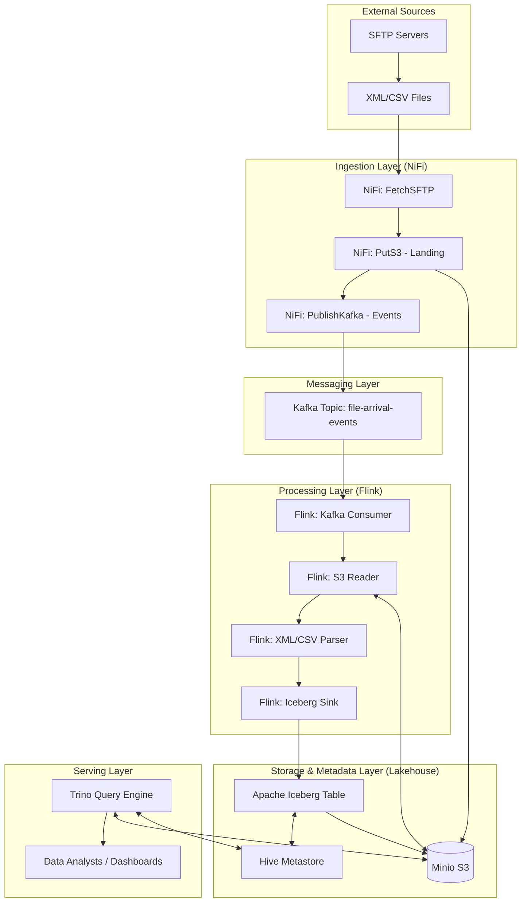

# Hệ thống Kiến trúc Giám sát Server (Lakehouse Architecture)

Tài liệu này mô tả chi tiết luồng dữ liệu và cấu trúc các thành phần trong hệ thống từ khâu thu thập đến khâu truy vấn.

## 1. Sơ đồ kiến trúc (Data Flow Diagram)



## 2. Chi tiết các lớp (Layer Details)

### 2.1 Ingestion Layer (NiFi)
*   **Nhiệm vụ:** Di chuyển dữ liệu từ nguồn vào hạ tầng nội bộ.
*   **Cơ chế:**
    *   NiFi quét thư mục SFTP định kỳ.
    *   Đảm bảo tính tin cậy bằng cách chỉ gửi sự kiện lên Kafka **sau khi** file đã được lưu an toàn vào Minio.

### 2.2 Messaging Layer (Kafka)
*   **Nhiệm vụ:** Đóng vai trò là "Trigger" cho luồng xử lý thời gian thực.
*   **Payload ví dụ:**
    ```json
    {
      "event_id": "uuid-1234",
      "file_path": "s3a://landing/2024/05/20/metrics_100.xml",
      "arrival_time": "2024-05-20T10:00:00Z"
    }
    ```

### 2.3 Processing Layer (Flink)
*   **Nhiệm vụ:** Xử lý logic nghiệp vụ và định dạng dữ liệu.
*   **Đặc điểm:** 
    *   Xử lý dạng Statefull (nếu cần tính toán aggregator theo cửa sổ thời gian).
    *   Ghi dữ liệu xuống Iceberg theo batch (với interval 1 phút) để tránh tạo quá nhiều file nhỏ.

### 2.4 Storage Layer (Iceberg + Minio)
*   **Nhiệm vụ:** Lưu trữ dữ liệu lâu dài với hiệu năng cao.
*   **Iceberg:** Cung cấp khả năng ACID, Snapshot, và schema evolution. Dữ liệu thực tế nằm trên Minio dưới dạng Parquet files.

### 2.5 Serving Layer (Trino)
*   **Nhiệm vụ:** Cung cấp giao diện SQL cho người dùng cuối.
*   **Ưu điểm:** Tách biệt hoàn toàn tính toán (Trino) và lưu trữ (Minio), cho phép scale độc lập.

## 3. Deployment Topology (k3s/k3d)

Hệ thống được triển khai trên Kubernetes (k3s) với cấu trúc:
- **Namespace: `ingestion`**: Chứa NiFi.
- **Namespace: `streaming`**: Chứa Kafka, Flink.
- **Namespace: `lakehouse`**: Chứa Minio, Hive Metastore, Trino.
- **Resource Management:** Sử dụng `NodeSelector` hoặc `Affinity` để phân bổ các thành phần nặng (Flink, Trino) sang các Worker nodes khác nhau.
