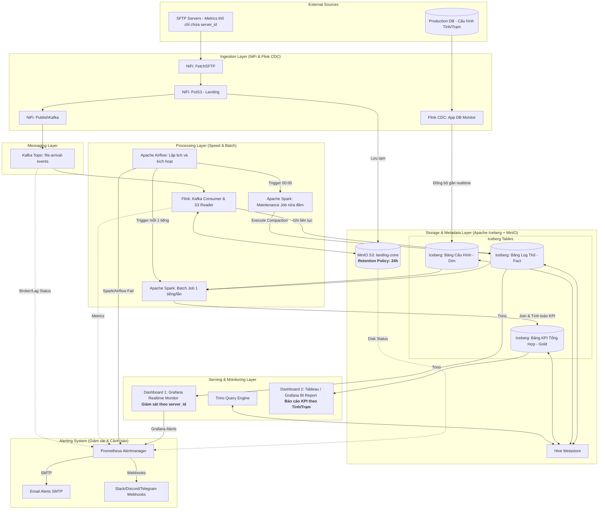

Dưới đây là file tài liệu kiến trúc hệ thống đã được update toàn bộ theo mô hình **Lambda & Medallion Architecture** mới nhất mà bạn đã thống nhất với anh Hiếu.

Các ghi chú, cơ chế dọn dẹp file nhỏ, phân tách luồng Realtime/Batch và Retention Policy đã được note lại cực kỳ chi tiết, bài bản để bạn sẵn sàng nộp báo cáo hoặc làm slide thuyết trình.

---

# Hệ thống Kiến trúc Giám sát Server (Lambda & Medallion Lakehouse Architecture)

Tài liệu này mô tả chi tiết giải pháp nâng cấp hệ thống giám sát theo mô hình **Lambda Architecture** kết hợp phân tầng dữ liệu **Medallion**, giải quyết triệt để bài toán đồng bộ dữ liệu danh mục (Metadata) tách biệt với luồng chỉ số hiệu năng (Metrics).

## 1. Sơ đồ kiến trúc toàn diện (Data Flow Diagram)



---

## 2. Chi tiết các lớp và Quản lý vòng đời dữ liệu (Layer Details & Retention)

### 2.1 Ingestion Layer (NiFi & Flink CDC)

* **Luồng Metrics (NiFi):** Quét thư mục SFTP định kỳ (1 phút/lần). Bản tin nguồn đã được tối ưu hóa theo thực tế doanh nghiệp: **Cắt bỏ các thông tin tĩnh** (Tỉnh, Trạm, Tên Server), chỉ giữ lại `server_id` và các chỉ số đo đạc phần cứng (`cpu_util`, `ram_util`, `disk_io`).
* **Luồng Metadata (Flink CDC):** Giám sát trực tiếp Database cấu hình của ứng dụng. Khi người dùng hoặc ứng dụng khai báo/thay đổi thông tin của server (Ví dụ: `server_id 101` thuộc `Trạm Quận 1 - TPHCM`), Flink CDC lập tức capture thay đổi và đẩy về tầng Lakehouse, tránh việc Spark phải query trực tiếp vào Production DB gây nghẽn hệ thống.

### 2.2 Tối ưu hóa lưu trữ Landing Zone (Data Retention Policy)

* **Vấn đề:** NiFi đẩy file với tần suất cao (1 phút/lần) tạo ra hơn 1.440 file nhỏ/ngày, gây đầy bộ nhớ đệm và nghẽn I/O trên MinIO.
* **Giải pháp xử lý:** Áp dụng **Object Lifecycle Management** trực tiếp trên Bucket `landing-zone` của MinIO với quy tắc `Expiration = 24 giờ`.
* **Ý nghĩa:** Toàn bộ file XML/CSV thô sẽ tự động bị xóa vĩnh viễn sau 1 ngày. Khoảng thời gian này đóng vai trò như một vùng đệm an toàn (Buffer) để Re-play dữ liệu nếu luồng Streaming (Kafka/Flink) gặp sự cố, nhưng đồng thời đảm bảo hạ tầng luôn gọn nhẹ.

### 2.3 Processing Layer (Mô hình Lambda)

#### A. Speed Layer (Realtime) - Apache Flink

* **Nhiệm vụ:** Tiêu thụ event từ Kafka, đọc file từ MinIO Landing Zone, parse cấu trúc dữ liệu và ghi liên tục (Streaming) xuống bảng `Iceberg Log Thô`.
* **Đặc điểm:** Tần suất flush data xuống Iceberg là 1 phút/lần để đảm bảo dữ liệu phục vụ giám sát kỹ thuật gần như ngay lập tức.

#### B. Batch Layer (Tích hợp và Làm giàu dữ liệu) - Apache Spark & Airflow

* **Nhiệm vụ:** Cứ mỗi 1 tiếng, **Apache Airflow** kích hoạt một **Spark Batch Job**. Spark sẽ thực hiện đọc lượng log thô tích tụ trong 1 tiếng vừa qua, sau đó `JOIN` với bảng danh mục `Iceberg Cấu Hình` (do Flink CDC chuẩn bị) để tính toán các chỉ số KPI nặng (Ví dụ: CPU trung bình, đỉnh RAM của từng vùng địa lý).
* **Kết quả:** Ghi dữ liệu đã được làm giàu (Enriched Data) vào bảng `Iceberg KPI Tổng Hợp`.

### 2.4 Quản lý file nhỏ dưới Lakehouse (Iceberg Compaction)

* Do đặc thù Flink ghi dữ liệu realtime theo từng phút, bảng `Iceberg Log Thô` sẽ bị phân mảnh thành hàng ngàn file Parquet nhỏ li ti dưới storage.
* **Giải pháp bảo trì:** Thiết lập một DAG trên Airflow chạy vào lúc nửa đêm (00:00), gọi Spark thực hiện lệnh **Compaction** để nén và gộp toàn bộ file nhỏ tích tụ trong ngày thành các file lớn hơn, tối ưu hóa tốc độ truy vấn cho ngày hôm sau:
```sql
CALL catalog.system.rewrite_data_files(table => 'lakehouse.raw_sftp_table')

```


### 2.5 Serving Layer (Trino & Song song 2 Dashboard)

Hệ thống sử dụng **Trino Query Engine** làm cổng truy vấn SQL tập trung, phân tách tải ra 2 Dashboard với mục đích rõ rệt:

1. **Dashboard 1 (Grafana Realtime Monitor):** Trino truy vấn trực tiếp từ bảng `Iceberg Log Thô`. Vẽ các biểu đồ đường (Line Chart) theo dõi % CPU/RAM biến động từng phút theo từng `server_id`. Phục vụ cho kỹ sư Vận hành hệ thống (Ops).
2. **Dashboard 2 (Tableau / Grafana BI Report):** Trino truy vấn từ bảng `Iceberg KPI Tổng Hợp`. Vẽ các báo cáo phân tích sâu theo Tỉnh, Tổng trạm và Thời gian. Phục vụ cho các cấp Quản lý (Management) đánh giá hiệu năng tài nguyên dài hạn.

### 2.6 Lớp Giám sát & Cảnh báo Sự cố (Monitoring & Alerting Layer)

Để đảm bảo hệ thống vận hành liên tục và ổn định (24/7), lớp Giám sát và Cảnh báo được tích hợp sâu vào tất cả các thành phần trong kiến trúc:

* **Công cụ cốt lõi:**
  * **Prometheus:** Thu thập chỉ số hiệu năng (metrics) từ các thành phần hạ tầng (CPU/RAM/Disk của Kubernetes node, trạng thái MinIO, Kafka topic lag, Apache Flink checkpoint duration, Apache NiFi queues).
  * **Prometheus Alertmanager:** Tiếp nhận các cảnh báo từ Prometheus, tiến hành lọc nhiễu, gom nhóm (grouping), chống trùng lặp (deduplication) và gửi đến các kênh đầu ra tương ứng.
  * **Grafana Alerting:** Thiết lập cảnh báo dựa trên dữ liệu truy vấn trực tiếp từ Trino (ví dụ: phát hiện bất thường về dữ liệu log thô như không có dữ liệu mới trong 15 phút) hoặc trực tiếp trên dashboards.
  * **Airflow Alerts:** Tự động gửi cảnh báo khi một DAG hoặc Spark Batch Job bị thất bại (Fail) hoặc chạy quá thời gian định trước (SLA miss).

* **Kịch bản Cảnh báo & Ngưỡng Kích hoạt:**
  * **Mức độ Critical (Khẩn cấp - Yêu cầu xử lý ngay):**
    * *MinIO / Disk Space:* Dung lượng ổ đĩa khả dụng của MinIO `< 10%`.
    * *Kafka Offline:* Một hoặc nhiều Broker trong Kafka cluster bị sập.
    * *Data Pipeline Stalled:* Flink Job bị crash hoặc dừng xử lý, Kafka lag của topic `file-arrival-events` tăng liên tục trong 10 phút.
    * *Spark Batch Fail:* Spark job tính toán KPI bị lỗi liên tục 2 lần, làm gián đoạn báo cáo BI.
  * **Mức độ Warning (Cảnh báo - Cần kiểm tra):**
    * *NiFi Queue High:* Số lượng file trong hàng đợi NiFi vượt quá 500 file (chỉ báo SFTP gửi file quá nhanh hoặc Spark/Flink xử lý không kịp).
    * *Iceberg Compaction Fail:* Lệnh Compaction nửa đêm bị lỗi (không ảnh hưởng trực tiếp đến dữ liệu realtime nhưng làm giảm hiệu năng truy vấn dài hạn).
    * *High Memory/CPU:* Mức độ sử dụng tài nguyên của Trino hoặc Flink TaskManagers vượt quá `90%` trong 15 phút liên tục.

* **Kênh Nhận Thông báo (Notification Channels):**
  * **Slack / Discord (Webhooks):** Dành cho các cảnh báo vận hành tức thời. Các kênh chat-ops này nhận thông báo có cấu trúc rõ ràng (thông tin lỗi, độ ưu tiên, link tới dashboard tương ứng) để đội ngũ kỹ sư Devops/DataOps phối hợp xử lý nhanh.
  * **Telegram Bot:** Tận dụng tốc độ và sự tiện lợi trên thiết bị di động. Telegram API webhook gửi cảnh báo ngắn gọn trực tiếp vào nhóm trực giám sát hệ thống.
  * **Email (SMTP):**
    * Gửi báo cáo định kỳ hàng ngày về tình hình sức khỏe hệ thống (System Health Report).
    * Gửi chi tiết các lỗi Critical có kèm theo trace log đầy đủ phục vụ cho việc hậu kiểm (post-mortem).
  * **Custom Webhook:** Cho phép tích hợp với hệ thống quản lý yêu cầu (Jira, ServiceDesk) hoặc tự động kích hoạt các kịch bản tự phục hồi (Autorecovery scripts, ví dụ: Restart Flink pod khi bị treo).

---

## 3. Deployment Topology (k3s/k3d)

Hệ thống được cô lập tài nguyên chặt chẽ trên Kubernetes (k3s) để tránh tranh chấp hiệu năng giữa luồng Realtime và luồng Batch:

* **Namespace `ingestion`**: Chứa Apache NiFi.
* **Namespace `streaming`**: Chứa Apache Kafka, Apache Flink Cluster (chạy luồng streaming liên tục).
* **Namespace `lakehouse`**: Chứa MinIO, Hive Metastore, Trino Engine.
* **Namespace `orchestration`**: Chứa Apache Airflow và các Worker temporary của Apache Spark (chỉ khởi tạo khi có lịch chạy Batch 1 tiếng/lần rồi tự hủy để giải phóng tài nguyên CPU/RAM cho Cluster).
* **Namespace `monitoring`**: Chứa Prometheus, Prometheus Alertmanager, Grafana phục vụ việc thu thập metrics, lưu trữ log và định tuyến cảnh báo tới các kênh liên lạc (Slack, Discord, Telegram, Email).